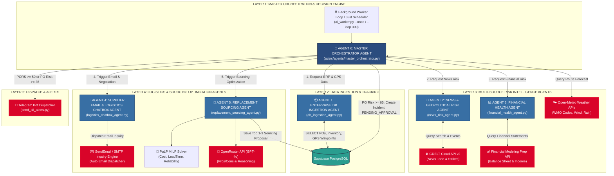
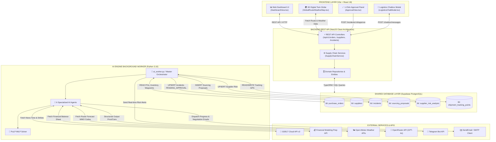
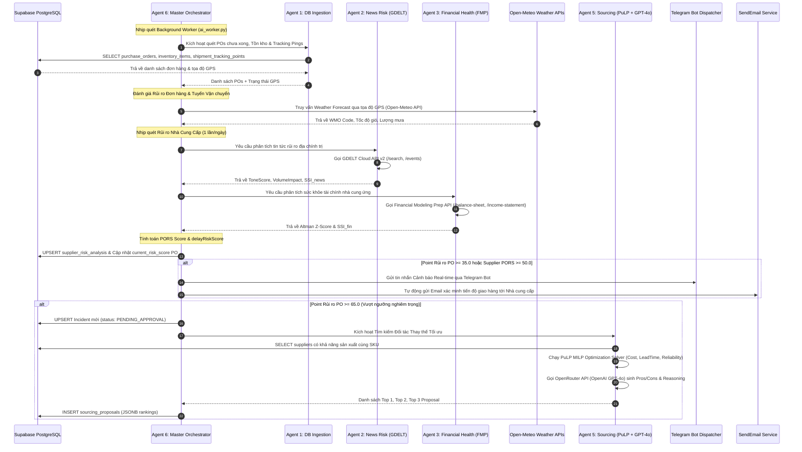

# 07. ĐẶC TẢ MÔ HÌNH TƯƠNG TÁC AI AGENTS & HỆ THỐNG APIS (FE, BE, DB, AI, TELEGRAM, SENDEMAIL)

Tài liệu này là bản đặc tả kỹ thuật chi tiết về cách mô hình **6 AI Agents** tương tác nội bộ và tương tác toàn diện với 6 phân hệ hệ thống: **Frontend (FE)**, **Backend (BE)**, **Supabase PostgreSQL (DB)**, **AI Background Engine (AI)**, **Telegram Bot Dispatcher (TELEGRAM)** và **SendEmail / SMTP Inquiry Client (SENDEMAIL)**.

---

## 📌 1. SƠ ĐỒ KIẾN TRÚC PHÂN CẤP 6 AI AGENTS (AI AGENT ARCHITECTURE)

---

## 🏗️ 2. SƠ ĐỒ TƯƠNG TÁC HỆ THỐNG (FE + BE + DB + AI + TELEGRAM + SENDEMAIL)

---

## 🔄 3. SEQUENCE DIAGRAM LUỒNG XỬ LÝ CHI TIẾT (PROCESSING SEQUENCE FLOW)

---
*© 2026 ResiliChain AI Engine Documentation.*
