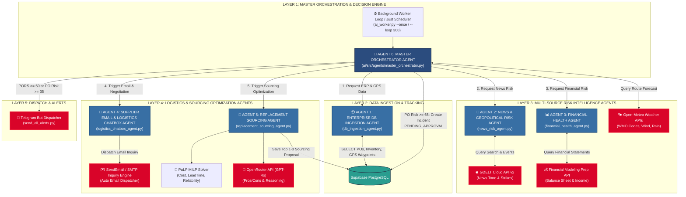
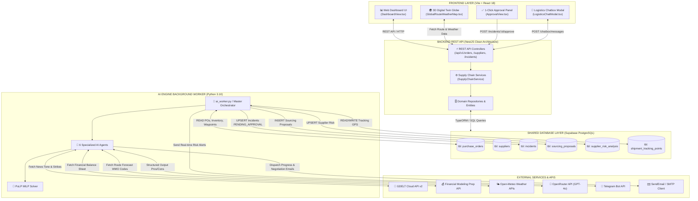
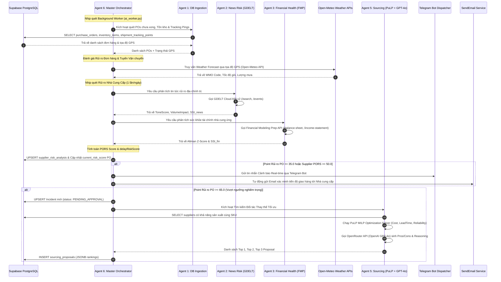

# 🤖 RESILICHAIN — MÔ HÌNH TƯƠNG TÁC AI AGENTS & ĐẶC TẢ TÍCH HỢP APIS

> **Tài liệu Kỹ thuật**: Chi tiết mô hình tương tác giữa 6 AI Agents, danh sách các API bên ngoài, dữ liệu trích xuất (Data Retrieved), cấu trúc request/response, và các cơ chế an toàn tải (Rate Limit, Cache, Fallback).

---

## 📌 1. TỔNG QUAN MÔ HÌNH TƯƠNG TÁC MULTI-AGENT & HỆ THỐNG

### 1.1 Sơ Đồ Kiến Trúc Phân Cấp 6 AI Agents (AI Agent Architecture)

---

### 1.2 Sơ Đồ Tương Tác Hệ Thống (FE + BE + DB + AI + TELEGRAM + SENDEMAIL)

---

### 1.3 Sequence Diagram Luồng Xử Lý Chi Tiết (Processing Sequence Flow)

---

## 🤖 2. CHI TIẾT TƯƠNG TÁC & API CỦA TỪNG AGENT

---

### 2.1 AGENT 1: Enterprise DB Ingestion Agent

- **File Implementation**: [`ai/src/agents/db_ingestion_agent.py`](file:///Users/anhnon/4conbo/ai/src/agents/db_ingestion_agent.py)
- **Nhiệm vụ**: Kết nối Supabase DB, trích xuất danh sách POs chưa hoàn thành, vị trí tồn kho, danh mục nhà cung cấp và các mốc tọa độ GPS dừng của lô hàng (`transitWaypoints`).
- **Hệ thống tương tác**: Supabase PostgreSQL Database (Dùng chung với Backend).
- **Dữ liệu trích xuất (Data Retrieved)**:
  - `purchase_orders`: `id`, `po_number`, `supplier_id`, `sku`, `quantity`, `promised_delivery_date`, `actual_or_expected_delivery_date`, `status`.
  - `suppliers`: `id`, `name`, `country`, `reliability_score`, `provided_skus`.
  - `inventory_items`: `sku`, `current_stock`, `safety_stock`.
  - `shipment_tracking_points`: `shipment_id`, `location_name`, `latitude`, `longitude`, `timestamp`.
- **Dữ liệu đầu ra**: Tập hợp các DTO `PurchaseOrderDto`, `SupplierDto`, `InventoryDto` chuyển cho Master Orchestrator (Agent 6).

---

### 2.2 AGENT 2: News & Geopolitical Risk Agent

- **File Implementation**: [`ai/src/agents/news_risk_agent.py`](file:///Users/anhnon/4conbo/ai/src/agents/news_risk_agent.py) & [`ai/src/integrations/gdelt.py`](file:///Users/anhnon/4conbo/ai/src/integrations/gdelt.py)
- **Nhiệm vụ**: Đánh giá rủi ro truyền thông, đình công, thiên tai và rủi ro địa chính trị quốc gia đặt nhà máy.
- **Hệ thống / API bên ngoài tương tác**: **GDELT Cloud API v2**
  - **Base URL**: `https://gdeltcloud.com/api/v2`
  - **Authentication**: `Authorization: Bearer {GDELT_API_KEY}`
  - **Endpoints & Method**:
    1. `GET /search?q={supplier_name}&limit=5`: Tra cứu thực thể doanh nghiệp lấy `spine_id` và mật độ đưa tin 30 ngày (`coverage_30d`).
    2. `GET /events?entity={spine_id}&q={RISK_QUERY}&window=30d`: Quét các sự kiện rủi ro (đình công, cháy nhà máy, lệnh cấm xuất khẩu, thiếu hụt linh kiện).
- **Dữ liệu trích xuất (Data Retrieved)**:
  - `ToneScore`: Điểm cảm xúc bài báo (âm nặng $< -5.0$ biểu thị khủng hoảng nghiêm trọng).
  - `VolumeImpact`: Tần suất đưa tin bất thường trong 30 ngày.
  - `GeoRiskPenalty`: Hệ số rủi ro địa chính trị theo mã quốc gia (ví dụ: TW: 0.90, CN: 0.78, US: 0.25, VN: 0.40).
  - `KeyEvent`: Tiêu đề bài báo, ngày xảy ra sự cố, mức độ nghiêm trọng (`critical`, `high`, `medium`).
- **Dữ liệu đầu ra**: `NewsRiskResult` bao gồm chỉ số $SSI_{\text{news}}$ ($0 - 100$) và danh sách sự kiện rủi ro cốt lõi.

---

### 2.3 AGENT 3: Financial Health Agent

- **File Implementation**: [`ai/src/agents/financial_health_agent.py`](file:///Users/anhnon/4conbo/ai/src/agents/financial_health_agent.py) & [`ai/src/integrations/fmp.py`](file:///Users/anhnon/4conbo/ai/src/integrations/fmp.py)
- **Nhiệm vụ**: Phân tích sức khỏe tài chính, khả năng thanh khoản và nguy cơ phá sản của nhà cung ứng.
- **Hệ thống / API bên ngoài tương tác**: **Financial Modeling Prep (FMP) API**
  - **Base URL**: `https://financialmodelingprep.com/stable`
  - **Authentication**: Query Param `?apikey={FMP_API_KEY}`
  - **Endpoints & Method**:
    1. `GET /balance-sheet-statement/{symbol}?limit=1`: Lấy Tài sản ngắn hạn (Current Assets), Nợ ngắn hạn (Current Liabilities), Tổng tài sản (Total Assets), Vốn chủ sở hữu (Total Equity), Nợ phải trả (Total Liabilities).
    2. `GET /income-statement/{symbol}?limit=1`: Lấy Lợi nhuận giữ lại (Retained Earnings), Lợi nhuận trước thuế & lãi vay (EBIT), Doanh thu thuần (Revenue).
- **Dữ liệu trích xuất (Data Retrieved)**:
  - 5 biến số đầu vào của mô hình Altman Z-Score ($X_1 \dots X_5$):
    - $X_1 = \text{Vốn lưu động} / \text{Tổng tài sản}$
    - $X_2 = \text{Lợi nhuận giữ lại} / \text{Tổng tài sản}$
    - $X_3 = \text{EBIT} / \text{Tổng tài sản}$
    - $X_4 = \text{Giá trị thị trường vốn CSH} / \text{Tổng nợ phải trả}$
    - $X_5 = \text{Doanh thu} / \text{Tổng tài sản}$
- **Dữ liệu đầu ra**: `FinancialResult` gồm chỉ số **Altman Z-Score** ($Z = 1.2 X_1 + 1.4 X_2 + 3.3 X_3 + 0.6 X_4 + 0.999 X_5$), Vùng rủi ro (`DISTRESS`, `GREY`, `SAFE`) và chỉ số $SSI_{\text{fin}}$.

---

### 2.4 AGENT 4: Supplier Email Inquiry & B2B Logistics Chatbox Agent

- **File Implementation**: [`ai/src/agents/logistics_chatbox_agent.py`](file:///Users/anhnon/4conbo/ai/src/agents/logistics_chatbox_agent.py)
- **Nhiệm vụ**: Tự động sinh nội dung Email truy vấn tiến độ và cung cấp giao diện Chatbot thông minh đàm phán giải pháp vận tải (chuyển đổi Sea Freight sang Air Freight, tách nhỏ đơn hàng).
- **Hệ thống / API bên ngoài tương tác**: **OpenRouter API (OpenAI GPT-4o)**
  - **Base URL**: `https://openrouter.ai/api/v1`
  - **Authentication**: `Authorization: Bearer {OPENROUTER_API_KEY}`
  - **Endpoint**: `POST /chat/completions` (Model: `openai/gpt-4o`)
- **Dữ liệu trích xuất (Data Retrieved)**: Văn bản phản hồi tư vấn phương án logistics, mẫu email đàm phán theo bối cảnh PO cụ thể.

---

### 2.5 AGENT 5: Supplier Replacement Sourcing Agent

- **File Implementation**: [`ai/src/agents/replacement_sourcing_agent.py`](file:///Users/anhnon/4conbo/ai/src/agents/replacement_sourcing_agent.py), [`ai/src/core/milp_solver.py`](file:///Users/anhnon/4conbo/ai/src/core/milp_solver.py), & [`ai/src/integrations/openrouter_client.py`](file:///Users/anhnon/4conbo/ai/src/integrations/openrouter_client.py)
- **Nhiệm vụ**: Giải bài toán Quy hoạch Tuyến tính (PuLP MILP Solver) tìm kiếm các nhà cung ứng có khả năng sản xuất cùng mã SKU/HS Code, sau đó dùng LLM sinhPros/Cons & Reasoning.
- **Thuật toán & API tương tác**:
  1. **Nội bộ**: Chạy **PuLP MILP Solver (Python)** tính điểm tổng hợp:
     $$\text{Score}_i = \text{round}\left( 0.45 \cdot \text{CostScore}_i + 0.35 \cdot \text{LeadTimeScore}_i + 0.20 \cdot \text{ReliabilityScore}_i \right)$$
  2. **Bên ngoài**: Call **OpenRouter API (OpenAI GPT-4o)** với Pydantic Structured Output Schema.
     - **Endpoint**: `POST https://openrouter.ai/api/v1/chat/completions`
     - **Payload JSON**: Chứa danh sách các đối tác đã qua MILP Solver, giá original, leadtime.
- **Dữ liệu trích xuất (Data Retrieved)**:
  - `rankings`: Mảng Top 1, Top 2, Top 3 nhà cung cấp (gồm `supplierId`, `supplierName`, `unitPrice`, `totalCost`, `leadTimeDays`, `pros`, `cons`, `score`, `reasoning`).
  - `recommendation`: Kết luận kiến nghị gửi Ban Quản lý Thu mua.
- **Dữ liệu đầu ra**: Bản ghi `SourcingProposalDto` ghi trực tiếp vào bảng `sourcing_proposals` trong Supabase DB.

---

### 2.6 AGENT 6: Master Orchestrator Agent

- **File Implementation**: [`ai/src/agents/master_orchestrator.py`](file:///Users/anhnon/4conbo/ai/src/agents/master_orchestrator.py) & [`ai/src/integrations/open_meteo.py`](file:///Users/anhnon/4conbo/ai/src/integrations/open_meteo.py) & [`ai/src/integrations/telegram.py`](file:///Users/anhnon/4conbo/ai/src/integrations/telegram.py)
- **Nhiệm vụ**: Tổng chỉ huy luồng công việc, gọi Open-Meteo APIs tính dự báo thời tiết tuyến, tổng hợp `delayRiskScore` & `PORS`, phát hiện Incident và gửi Telegram Alert.
- **Hệ thống / API bên ngoài tương tác**:
  1. **Open-Meteo Geocoding API**: `GET https://geocoding-api.open-meteo.com/v1/search?name={location_name}&count=1` -> Lấy tọa độ GPS (`latitude`, `longitude`).
  2. **Open-Meteo Forecast API**: `GET https://api.open-meteo.com/v1/forecast?latitude={lat}&longitude={lon}&current=weather_code,wind_speed_10m,wind_gusts_10m,precipitation&daily=precipitation_sum` -> Lấy mã WMO Code 4677, tốc độ gió, gió giật, lượng mưa tích tụ.
  3. **Telegram Bot API**: `POST https://api.telegram.org/bot{TELEGRAM_BOT_TOKEN}/sendMessage` -> Phát tin nhắn Cảnh báo Real-time cho Ban Quản lý.
- **Dữ liệu trích xuất (Data Retrieved)**:
  - `weather_code`, `wind_speed_10m`, `precipitation_sum` -> Quy đổi thành `weatherDelayForecast` (+0 đến +7 ngày trễ).
  - Trạng thái phản hồi thành công `ok: true` từ Telegram API.
- **Dữ liệu đầu ra**: Ghi bản ghi vào `incidents`, `supplier_risk_analysis`, `ai_job_runs` và đẩy notification qua Telegram.

---

## 📊 3. BẢNG TỔNG HỢP DANH SÁCH APIS BÊN NGOÀI (MASTER CATALOG)

| Tên Dịch Vụ / API | Base URL / Endpoint | Phương Thức | Authentication | Dữ Liệu Trích Xuất Cốt Lõi | Agent Sử Dụng |
| :--- | :--- | :---: | :--- | :--- | :---: |
| **Supabase PostgreSQL** | `aws-0-ap-southeast-1.pooler.supabase.com:6543` | TCP / SQL | DB User / Password | POs, Tồn kho, Suppliers, Incidents, Tracking GPS | Agent 1 & Agent 6 |
| **GDELT Cloud API v2** | `https://gdeltcloud.com/api/v2/search`  `https://gdeltcloud.com/api/v2/events` | GET | Bearer Token | ToneScore, Coverage 30d, Đình công, Cháy nhà máy, Tin tức rủi ro | Agent 2 |
| **Financial Modeling Prep (FMP)** | `https://financialmodelingprep.com/stable/balance-sheet-statement`  `/income-statement` | GET | Query Param `?apikey=` | Current Assets/Liabilities, EBIT, Total Assets (Tính Altman Z-Score) | Agent 3 |
| **Open-Meteo Geocoding** | `https://geocoding-api.open-meteo.com/v1/search` | GET | Không cần Key (Free) | Tọa độ GPS (`latitude`, `longitude`) từ tên địa danh / cảng biển | Agent 6 |
| **Open-Meteo Forecast** | `https://api.open-meteo.com/v1/forecast` | GET | Không cần Key (Free) | WMO Weather Code 4677, Tốc độ gió ($>50$km/h), Lượng mưa ngày ($>50$mm) | Agent 6 |
| **OpenRouter / OpenAI** | `https://openrouter.ai/api/v1/chat/completions` | POST | Bearer Token | Pros/Cons list, Reasoning, Recommendation, Email Logistics template | Agent 4 & Agent 5 |
| **Telegram Bot API** | `https://api.telegram.org/bot{TOKEN}/sendMessage` | POST | Bot Token URL Path | Trạng thái gửi tin nhắn Cảnh báo Real-time (`message_id`, `chat_id`) | Agent 6 |

---

## 🛡️ 4. CƠ CHẾ ĐỀU TIẾT & AN TOÀN TẢI (RATE LIMITING & CACHING)

Nhằm đảm bảo hệ thống vận hành liên tục không bị khóa API key hay quá tải hạ tầng, các cơ chế an toàn tải được triển khai tại lớp `HttpClient` (`ai/src/integrations/http.py`):

1. **Giới Hạn Tần Suất Gửi Request (Rate Limiting RPM)**:
   - **GDELT API**: Giới hạn tối đa **30 requests/phút** (`settings.gdelt_rate_limit_rpm = 30`).
   - **FMP API**: Giới hạn tối đa **45 requests/phút** (`settings.fmp_rate_limit_rpm = 45`).
   - Tự động tạm dừng thread khi chạm giới hạn hạn ngạch.
2. **Cơ Chế Bộ Đệm Dữ Liệu (Caching TTL)**:
   - **FMP Financial Data**: Báo cáo tài chính doanh nghiệp thay đổi theo quý -> Cache dữ liệu trong **12 giờ** (`FMP_CACHE_TTL_SECONDS = 43200`).
   - **Open-Meteo Weather Data**: Thời tiết thay đổi nhanh -> Cache dữ liệu trong **30 phút** (`cache_ttl_seconds = 1800`).
3. **Xử Lý Lỗi & Fallback Khi API Bên Ngoài Gặp Sự Cố**:
   - Nếu GDELT API timeout hoặc ngắt kết nối: Tự động trả về `SSI_news` mặc định trung tính (50.0) và ghi log cảnh báo.
   - Nếu FMP API trả lỗi `429 Limit Reached`: Chuyển sang sử dụng dữ liệu tài chính lịch sử gần nhất trong database (`stale cache`), không retry vô ích.

---
*© 2026 ResiliChain Team — Multi-Agent Interaction Specification.*
