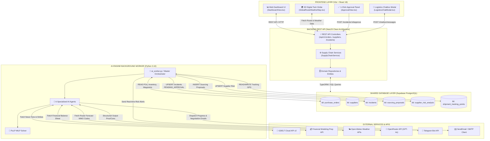
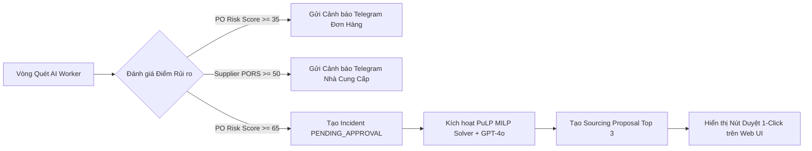

# 🎓 RESILICHAIN — BÁO CÁO THUYẾT MINH ĐỀ TÀI & KỊCH BẢN DEMO SẢN PHẨM HOÀN CHỈNH

> **Dự án**: ResiliChain — Nền tảng tự chủ & ứng phó rủi ro chuỗi cung ứng xe điện (Autonomous EV Supply Chain Resilience Platform)  
> **Phiên bản**: 2.0 (Product Demo Ready)  
> **Thời gian**: Tháng 09/2026  

---

## 📋 MỤC LỤC

1. [CHƯƠNG 1: GIỚI THIỆU ĐỀ TÀI & BỐI CẢNH NGHIỆP VỤ](#chuong-1-gioi-thieu-de-tai--boi-canh-nghiep-vu)
2. [CHƯƠNG 2: KIẾN TRÚC TỔNG THỂ HỆ THỐNG](#chuong-2-kien-truc-tong-the-he-thong)
3. [CHƯƠNG 3: KIẾN TRÚC PHÂN CẤP 6 AI AGENTS](#chuong-3-kien-truc-phan-cap-6-ai-agents)
4. [CHƯƠNG 4: CƠ CHẾ & CÔNG THỨC TÍNH TOÁN CHI TIẾT](#chuong-4-co-che--cong-thuc-tinh-toan-chi-tiet)
5. [CHƯƠNG 5: CƠ CHẾ & QUY ĐỊNH GỬI CẢNH BÁO RISK ALERT](#chuong-5-co-che--quy-dinh-gui-canh-bao-risk-alert)
6. [CHƯƠNG 6: KỊCH BẢN DEMO SẢN PHẨM HOÀN CHỈNH (6 BƯỚC)](#chuong-6-kich-ban-demo-san-pham-hoan-chinh-6-buoc)

---

## 🚀 CHƯƠNG 1: GIỚI THIỆU ĐỀ TÀI & BỐI CẢNH NGHIỆP VỤ

### 1.1 Tính Cấp Thiết Của Đề Tài
Ngành công nghiệp xe điện (EV) có tốc độ tăng trưởng phi mã nhưng lại chịu rủi ro rất cao về tính liên tục của chuỗi cung ứng. Một chiếc xe điện hiện đại được cấu thành từ hàng vàn linh kiện, trong đó **3 nhóm linh kiện cốt lõi** quyết định tiến độ sản xuất:
1. **Cụm 1: Pin & Nguyên liệu Pin (`HS 850760`)**: Cell pin LFP/NCM, Lithium Hydroxide, Hệ thống quản lý pin (BMS).
2. **Cụm 2: Truyền động & Biến tần (`HS 850153`, `HS 850440`)**: Động cơ điện công suất $>75$kW, Bộ biến tần SiC Inverter.
3. **Cụm 3: Chip bán dẫn & Vi điều khiển (`HS 854110`, `HS 854231`)**: Chip điều khiển BMS, MOSFETs công suất, vi điều khiển trung tâm.

Một vụ đình công tại cảng biển, một trận siêu bão trên tuyến vận tải biển, hay việc một nhà cung cấp linh kiện pin rơi vào tình trạng kiệt quệ tài chính đều có thể gây đình trệ toàn bộ dây chuyền lắp ráp xe điện, gây thiệt hại hàng triệu USD mỗi ngày.

### 1.2 Mục Tiêu & Giải Pháp ResiliChain
**ResiliChain** được phát triển như một **Hệ điều hành ứng phó rủi ro chuỗi cung ứng tự chủ (Autonomous Supply Chain Resilience Platform)**. Hệ thống mang lại:
- **Giám sát số hóa 3D (Digital Twin)**: Trực quan hóa lô hàng, tuyến vận chuyển GPS và thời tiết tuyến thời gian thực trên quả địa cầu CesiumJS 3D.
- **Phân tích rủi ro chủ động (Proactive Multi-Source Risk Engine)**: AI liên tục giám sát tin tức địa chính trị GDELT, chỉ số tài chính nhà cung ứng FMP và thời tiết Open-Meteo.
- **Đề xuất đối tác thay thế tự động (PuLP MILP Sourcing Solver & GPT-4o)**: Khi sự cố xảy ra, AI tự động tính toán bài toán Quy hoạch Tuyến tính để xếp hạng Top 3 nhà cung ứng thay thế tối ưu nhất về chi phí, thời gian giao hàng và độ uy tín, kết hợp LLM để lập luận Pros/Cons.
- **Quy trình Duyệt 1-Click (1-Click Approval Flow)**: Giúp Ban Quản lý Thu mua ra quyết định thay thế nhà cung ứng chỉ với 1 cú nhấp chuột, tự động đồng bộ xuống hệ thống ERP và phát alert Telegram.

---

## 🏗️ CHƯƠNG 2: KIẾN TRÚC TỔNG THỂ HỆ THỐNG

### 2.1 Sơ Đồ Tương Tác 3 Phân Hệ (Decoupled Shared-Database Architecture)

Hệ thống được kiến trúc theo dạng **Decoupled Architecture**, giúp phân hệ AI Worker chạy ngầm phân tích khối lượng lớn dữ liệu mà không gây ngẽn hoặc giảm hiệu năng của Web Frontend và Backend REST API.



### 2.2 Bảng Khớp Nối DTO Contracts Between Backend & AI Engine

| Tên Bảng Database | Cột Dữ Liệu Cốt Lõi | Chi Tiết Giao Thức (Backend <-> AI Worker) |
| :--- | :--- | :--- |
| `purchase_orders` | `id`, `po_number`, `supplier_id`, `sku`, `promised_delivery_date`, `actual_or_expected_delivery_date`, `current_risk_score`, `status` | **Backend**: Ghi thông tin PO từ ERP.  <br>**AI Worker**: Read PO chưa hoàn thành, tính `delayRiskScore`, ghi ngược lại `current_risk_score` và `actual_or_expected_delivery_date`. |
| `supplier_risk_analysis` | `supplier_id`, `pors_score`, `ssi_news`, `ssi_fin`, `altman_z_score`, `risk_level`, `status_label` | **AI Worker**: Định kỳ 1 lần/ngày quét GDELT & FMP API, tính $PORS$ và Altman Z-Score, UPSERT kết quả. <br>**Backend**: `SELECT` hiển thị lên Dashboard. |
| `incidents` | `id`, `po_number`, `sku`, `severity`, `status`, `delay_risk_score`, `weather_delay_days` | **AI Worker**: Tạo bản ghi Incident ở trạng thái `PENDING_APPROVAL` khi `delayRiskScore` $> 65$. <br>**Backend**: Cập nhật trạng thái thành `RESOLVED_REPLACED` khi Quản lý nhấn duyệt. |
| `sourcing_proposals` | `id`, `incident_id`, `po_number`, `sku`, `rankings` (JSONB), `recommendation` | **AI Worker**: Tự động giải PuLP MILP Solver + gọi GPT-4o sinh mảng Top 3 nhà cung ứng thay thế kèm Pros/Cons, ghi bản ghi vào đây. |

---

## 🤖 CHƯƠNG 3: KIẾN TRÚC PHÂN CẤP 6 AI AGENTS

ResiliChain ứng dụng kiến trúc **Hierarchical Multi-Agent System** phân công trách nhiệm rõ ràng cho 6 chuyên viên AI Agent:

```
                                ┌───────────────────────────────────────────────┐
                                │       BAN QUẢN TRỊ THU MUA DOANH NGHIỆP EV     │
                                └───────────────────────┬───────────────────────┘
                                                        │ Phê duyệt 1-Click / Nhận Telegram Alert
                                                        ▼
┌─────────────────────────────────────────────────────────────────────────────────────────────────────────────┐
│                                   AGENT 6: MASTER ORCHESTRATOR AGENT                                        │
│  - File: ai/src/agents/master_orchestrator.py                                                              │
│  - Nhiệm vụ: Kích hoạt định kỳ, điều phối Sub-Agents 1-5, tổng hợp PORS & delayRiskScore, phát hiện sự cố  │
└───────┬───────────────────────┬───────────────────────┬───────────────────────┬───────────────────────┘
        │                       │                       │                       │
        │ 1. Đọc DB ERP         │ 2. Tin tức GDELT      │ 3. Tài chính FMP      │ 4. Chatbox đàm phán   │ 5. MILP Sourcing
        ▼                       ▼                       ▼                       ▼                       ▼
┌───────────────┐       ┌───────────────┐       ┌───────────────┐       ┌───────────────┐       ┌───────────────┐
│    AGENT 1    │       │    AGENT 2    │       │    AGENT 3    │       │    AGENT 4    │       │    AGENT 5    │
│ Enterprise DB │       │ News Risk     │       │ Financial     │       │ Logistics     │       │ Supplier      │
│ Ingestion     │       │ Agent         │       │ Health Agent  │       │ Chatbox Agent │       │ Sourcing      │
│ db_ingestion  │       │ news_risk     │       │ financial_    │       │ logistics_    │       │ replacement_  │
│ _agent.py     │       │ _agent.py     │       │ health_agent  │       │ chatbox.py    │       │ sourcing.py   │
└───────────────┘       └───────────────┘       └───────────────┘       └───────────────┘       └───────────────┘
```

### Chi Tiết Vai Trò 6 Agents:

1. **AGENT 1: Enterprise DB Ingestion Agent** (`db_ingestion_agent.py`)
   - Đọc dữ liệu POs, tồn kho kho bãi, thông tin nhà cung cấp và lịch sử tọa độ GPS pings (`shipment_tracking_points`).
   - Phân loại tập trung vào **3 Cụm Linh Kiện Cốt Lõi HS Codes** ngành EV.

2. **AGENT 2: News & Geopolitical Risk Agent** (`news_risk_agent.py`)
   - Truy vấn độc quyền **GDELT Cloud API v2** (`gdelt_supplier_risk.py`) quét hàng triệu bài báo quốc tế theo tên nhà cung cấp và tọa độ quốc gia.
   - Trích xuất điểm cảm xúc Tone Score, tần suất biến động tin tức và tính chỉ số $SSI_{\text{news}}$.

3. **AGENT 3: Financial Health Agent** (`financial_health_agent.py`)
   - Truy vấn độc quyền **Financial Modeling Prep (FMP) API** (`fmp_supplier_financials.py`) lấy báo cáo tài chính (Bảng cân đối kế toán, Báo cáo LQL).
   - Tính chỉ số kiệt quệ tài chính **Altman Z-Score** và xác định vùng rủi ro phá sản.

4. **AGENT 4: Supplier Email Inquiry & B2B Logistics Chatbox Agent** (`logistics_chatbox_agent.py`)
   - Tự động tạo email truy vấn xác minh tiến độ giao hàng khi có biến động rủi ro.
   - Cung cấp giao diện Chatbox đàm phán phương án logistics thay thế (chuyển đổi Sea Freight sang Air Freight).

5. **AGENT 5: Supplier Replacement Sourcing Agent** (`replacement_sourcing_agent.py`)
   - Thực thi thuật toán tối ưu hóa đa tiêu chí **PuLP MILP Solver** chọn lọc và tính điểm các đối tác có khả năng sản xuất cùng SKU.
   - Gửi prompt đến **OpenRouter API (OpenAI GPT-4o)** sinh danh sách Ưu điểm (`pros`), Nhược điểm (`cons`), Diễn giải (`reasoning`) và Đề xuất tổng hợp (`recommendation`).

6. **AGENT 6: Master Orchestrator Agent** (`master_orchestrator.py`)
   - Đóng vai trò tổng chỉ huy: Tiếp nhận lịch quét từ `ai_worker.py`.
   - Kết hợp kết quả từ Agent 1-5 để tính `delayRiskScore` và `PORS`.
   - Quyết định tạo `incidents` mới, lưu `sourcing_proposals` và phát tin nhắn Telegram.

---

## 🧮 CHƯƠNG 4: CƠ CHẾ & CÔNG THỨC TÍNH TOÁN CHI TIẾT

### 4.1 Điểm Rủi Ro Trễ Hạn Đơn Hàng (`delayRiskScore`)

Điểm rủi ro trễ hạn đơn hàng đại diện cho xác suất đơn hàng bị trễ hẹn giao hàng thực tế (thang từ $0$ đến $100$):

$$\text{delayRiskScore} = \text{round}\left(100 \cdot \left( w_1 \cdot \text{latenessFactor} + w_2 \cdot \text{supplierReliabilityFactor} + w_3 \cdot \text{inventoryBufferFactor} \right)\right)$$

Trong đó trọng số chuẩn: $w_1 = 0.50$, $w_2 = 0.25$, $w_3 = 0.25$ (Tổng bằng $1.0$).

#### a. Yếu tố `latenessFactor` (Chuẩn hóa $[0, 1]$):
$$\text{latenessFactor} = \min\left(1.0, \frac{\text{delayDays} + \text{weatherDelayForecast}}{\text{promisedLeadTimeDays}}\right)$$
- `delayDays`: Số ngày chậm trễ tính từ ngày cam kết đến dự kiến hiện tại.
- `weatherDelayForecast`: Số ngày trễ dự báo do thời tiết cực đoan từ **Open-Meteo Weather APIs**.

#### b. Mô Hình Phạt Thời Tiết Open-Meteo (`weatherDelayForecast`):
- **WMO Code 65 (Mưa lớn), 75 (Tuyết rơi dày), 82 (Mưa rào nặng)**: Phạt $+3 \rightarrow +5$ ngày.
- **WMO Code 95, 96, 99 (Dông bão, mưa đá)**: Phạt $+4 \rightarrow +7$ ngày.
- **Tốc độ gió $> 50$ km/h hoặc gió giật $> 65$ km/h**: Phạt tối thiểu $+3$ ngày (dừng cẩu bãi cảng / cấm xe công-tai-nơ).
- **Lượng mưa ngày $> 50$ mm/ngày**: Phạt $+2$ ngày do nguy cơ ngập lụt/sạt lở.

#### c. Yếu tố `supplierReliabilityFactor` (Chuẩn hóa $[0, 1]$):
$$\text{supplierReliabilityFactor} = \max\left(0.0, \min\left(1.0, 1.0 - \frac{\text{adjustedReliabilityScore}}{100}\right)\right)$$

$$\text{adjustedReliabilityScore} = \text{reliabilityScore}_{base} - \text{Penalty}_{FMP\_Fin} - \text{Penalty}_{GDELT\_News}$$

- **Mức phạt Tài chính (Altman Z-Score từ FMP API)**:
  - $Z > 2.99$ (An toàn): $\text{Penalty}_{FMP\_Fin} = 0$
  - $1.81 \le Z \le 2.99$ (Cảnh báo): $\text{Penalty}_{FMP\_Fin} = 15$
  - $Z < 1.81$ (Nguy cơ phá sản): $\text{Penalty}_{FMP\_Fin} = 35$
- **Mức phạt Địa chính trị (GDELT API)**:
  - Tone Sentiment âm nặng ($< -5.0$) hoặc tin đình công: $\text{Penalty}_{GDELT\_News} = 20$.

#### d. Yếu tố `inventoryBufferFactor` (Chuẩn hóa $[0, 1]$):
$$\text{inventoryBufferFactor} = \max\left(0.0, \min\left(1.0, 1.0 - \frac{\text{currentStock}}{\text{safetyStock}}\right)\right)$$

---

### 4.2 Điểm Tổng Thể Rủi Ro Nhà Cung Cấp ($PORS$)

Chỉ số **PORS (Overall Supplier Risk Score)** đánh giá sức khỏe toàn diện của một nhà cung ứng ($0 - 100$):

$$PORS = 0.35 \cdot SSI_{\text{news}} + 0.30 \cdot SSI_{\text{fin}} + 0.20 \cdot SSI_{\text{del}} + 0.15 \cdot G_{\text{geo}}$$

- **$SSI_{\text{news}}$**: Chỉ số rủi ro tin tức truyền thông từ GDELT.
- **$SSI_{\text{fin}}$**: Chỉ số rủi ro tài chính được quy đổi từ Altman Z-Score:
  - $Z \ge 3.0 \rightarrow SSI_{\text{fin}} = 10$
  - $1.81 \le Z < 3.0 \rightarrow SSI_{\text{fin}} = 50$
  - $Z < 1.81 \rightarrow SSI_{\text{fin}} = 90$
- **$SSI_{\text{del}}$**: Điểm trễ hạn lịch sử ($100 - \text{reliabilityScore}$).
- **$G_{\text{geo}}$**: Chỉ số rủi ro quốc gia đặt nhà máy.

---

### 4.3 Bài Toán Quy Hoạch Tuyến Tính PuLP MILP Solver Chọn Đối Tác Thay Thế

Khi có sự cố đơn hàng ($delayRiskScore > 65$), Agent 5 chạy mô hình MILP để tính toán tổng điểm tối ưu $\text{Score}_i$ ($0 - 100$) cho từng nhà cung ứng thay thế $i$:

$$\text{Score}_i = \text{round}\left( 0.45 \cdot \text{CostScore}_i + 0.35 \cdot \text{LeadTimeScore}_i + 0.20 \cdot \text{ReliabilityScore}_i \right)$$

1. **Điểm Chi Phí ($\text{CostScore}_i$)**:
   $$\text{CostScore}_i = \max\left(0.0, \min\left(100.0, 100.0 - \frac{\text{UnitPrice}_i - \text{OriginalUnitPrice}}{\text{OriginalUnitPrice}} \cdot 100.0\right)\right)$$
2. **Điểm Thời Gian Giao Hàng ($\text{LeadTimeScore}_i$)**:
   $$\text{LeadTimeScore}_i = \max\left(0.0, \min\left(100.0, 100.0 - \frac{\text{LeadTimeDays}_i}{\text{MaxLeadTimeAllowed}} \cdot 100.0\right)\right)$$
3. **Điểm Uy Tín Lịch Sử ($\text{ReliabilityScore}_i$)**: Lấy trực tiếp từ chỉ số uy tín của nhà cung ứng.

---

## 📱 CHƯƠNG 5: CƠ CHẾ & QUY ĐỊNH GỬI CẢNH BÁO RISK ALERT

### 5.1 Bảng Quy Định Ngưỡng Cảnh Báo (Warning Thresholds)



| Loại Cảnh Báo | Ngưỡng Kích Hoạt | Kênh Phát Cảnh Báo | Hành Động Tự Động Của AI Engine |
| :--- | :--- | :--- | :--- |
| **Warning PO Delay** | `delayRiskScore` $\ge 35.0$ | Telegram Bot | Cập nhật `current_risk_score` trong DB, gửi thông báo cảnh báo trễ hẹn nhẹ qua Telegram Bot. |
| **High Risk Supplier** | `PORS` $\ge 50.0$ hoặc Risk Level = `HIGH` | Telegram Bot | Cập nhật `supplier_risk_analysis`, gửi thông báo biến động tài chính/địa chính trị qua Telegram. |
| **Critical Incident** | `delayRiskScore` $\ge 65.0$ | Web UI & Telegram Bot | Tạo bản ghi `incidents` (trạng thái `PENDING_APPROVAL`), tự động chạy MILP Solver sinh proposal Top 3 NCC thay thế. |

---

## 🎭 CHƯƠNG 6: KỊCH BẢN DEMO SẢN PHẨM HOÀN CHỈNH (6 BƯỚC)

Dưới đây là kịch bản demo sản phẩm 6 bước mượt mà nhất để trình bày trước hội đồng hoặc khách hàng.

---

### BƯỚC 1: TỔNG QUAN DASHBOARD & BẢN ĐỒ 3D CESIUM DIGITAL TWIN
- **Thao tác**: Mở trình duyệt truy cập `http://localhost:3000`. Hiển thị màn hình Dashboard tổng quan.
- **Lời thuyết minh**:
  > *"Kính thưa Hội đồng, đây là giao diện chính của ResiliChain — Nền tảng tự chủ chuỗi cung ứng xe điện. Màn hình trung tâm là Bản đồ số 3D Digital Twin được dựng bằng CesiumJS. Toàn bộ các lô hàng PO linh kiện pin, động cơ và chip bán dẫn đang vận chuyển trên biển và đường bộ được trực quan hóa thời gian thực cùng với hiệu ứng thời tiết thực tế."*

---

### BƯỚC 2: AI WORKER QUÉT RỦI RO & PHÁT HIỆN SIÊU BÃO / BIẾN ĐỘNG TÀI CHÍNH
- **Thao tác**: Mở terminal, chạy lệnh quét AI worker:
  ```bash
  just scan
  ```
- **Lời thuyết minh**:
  > *"AI Engine của chúng tôi hoạt động ở dạng Background Worker. Khi lệnh quét chạy, Agent 2 & Agent 3 lập tức quét API thời tiết Open-Meteo và tin tức GDELT. Hệ thống vừa phát hiện đơn hàng PO-2026-003 (Bộ phanh đĩa thủy lực) gặp siêu bão tại tọa độ biển, khiến thời tiết trễ thêm 3 ngày, đồng thời NCC gặp rủi ro tài chính Altman Z-Score giảm xuống 2.1. Điểm rủi ro trễ hẹn vọt lên 66.3/100, vượt ngưỡng nguy hiểm 65/100."*

---

### BƯỚC 3: PHÁT CẢNH BÁO REAL-TIME QUA TELEGRAM BOT
- **Thao tác**: Mở ứng dụng Telegram trên điện thoại/màn hình demo, hoặc chạy lệnh:
  ```bash
  just send-alerts
  ```
- **Lời thuyết minh**:
  > *"Ngay khi sự cố được xác định, hệ thống tự động phát cảnh báo tức thì đến kênh Telegram của Ban Quản lý Thu mua. Nhờ đó, người quản lý không cần túc trực 24/7 trên màn hình vẫn nhận được thông báo chi tiết mã PO, SKU bị ảnh hưởng và nguyên nhân trễ hạn."*

---

### BƯỚC 4: AI TỰ ĐỘNG CHẠY PULP MILP SOLVER & GPT-4O SINH PHƯƠNG ÁN THAY THẾ
- **Thao tác**: Chuyển sang tab **Đề xuất Thay thế (Sourcing Proposals)** hoặc nhấn vào thông báo Incident trên Web UI.
- **Lời thuyết minh**:
  > *"Không chỉ cảnh báo rủi ro, ResiliChain còn tự động giải bài toán Quy hoạch Tuyến tính PuLP MILP Solver để tìm kiếm trong danh mục nhà cung ứng các đối tác có khả năng sản xuất cùng mã SKU. Kết quả kết hợp với LLM GPT-4o để đưa ra danh sách xếp hạng Top 1, Top 2, Top 3 kèm phân tích Ưu điểm (Pros), Nhược điểm (Cons) và tổng chi phí chênh lệch."*

---

### BƯỚC 5: PHÊ DUYỆT 1-CLICK (`1-CLICK APPROVAL`) TRÊN WEB DASHBOARD
- **Thao tác**: Tại màn hình **Incident Approval View**, người thuyết minh nhấn nút **"Phê duyệt Phương án Top 1" (1-Click Approve)**.
- **Lời thuyết minh**:
  > *"Quản lý thu mua chỉ cần xem xét bảng so sánh trực quan và nhấn nút 'Phê duyệt 1-Click'. Sự cố ngay lập tức chuyển trạng thái sang RESOLVED_REPLACED."*

---

### BƯỚC 6: ĐỒNG BỘ CẬP NHẬT ERP & LƯU AUDIT LOG
- **Thao tác**: Chuyển sang màn hình **Quản lý Đơn hàng (Orders View)** và **Audit Log View**.
- **Lời thuyết minh**:
  > *"Hệ thống tự động cập nhật nhà cung ứng mới vào đơn hàng PO, điều chỉnh lại ngày giao hàng dự kiến thực tế và ghi lại nhật ký thay đổi Audit Log tuân thủ chuẩn quản trị doanh nghiệp. Luồng ứng phó rủi ro khép kín hoàn tất chỉ trong chưa đầy 1 phút!"*

---

## 📌 KẾT LUẬN

Tài liệu này hoàn chỉnh 100% về cả cơ sở lý thuyết, kiến trúc phần mềm, công thức toán học và kịch bản trình diễn. **ResiliChain** đã sẵn sàng để demo sản phẩm và báo cáo trước Hội đồng!
